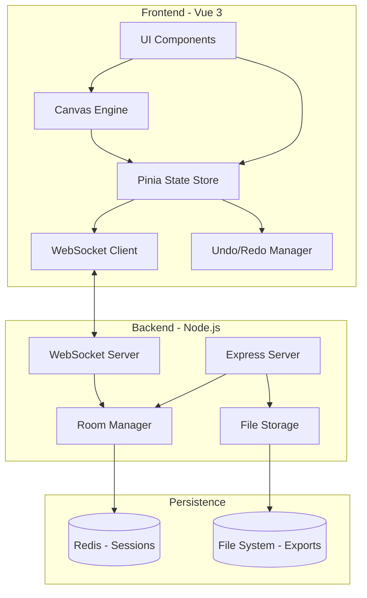
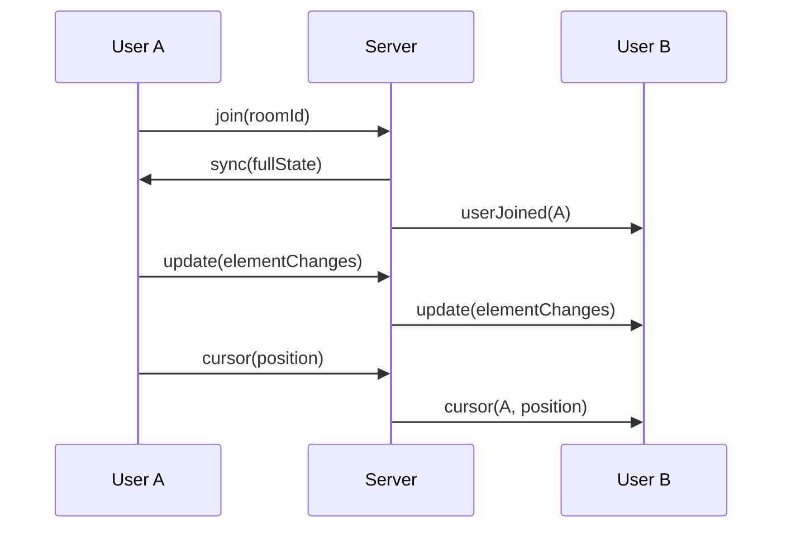
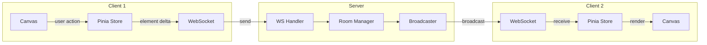

# Excalidraw Clone Implementation Plan

## Architecture Overview




## Tech Stack

| Layer | Technology ||-------|------------|| Frontend | Vue 3 + TypeScript + Vite || State Management | Pinia || Canvas | HTML5 Canvas API (2D Context) || Styling | Tailwind CSS || Backend | Node.js + Express + ws library || Session Store | Redis (optional, can use in-memory for dev) || Build | Vite (frontend), tsx/esbuild (backend) |

## Project Structure

```javascript
sticks/
├── client/                    # Vue 3 Frontend
│   ├── src/
│   │   ├── components/
│   │   │   ├── canvas/        # Canvas rendering components
│   │   │   ├── toolbar/       # Tool selection UI
│   │   │   ├── sidebar/       # Properties panel, layers
│   │   │   ├── modals/        # Export, share, library modals
│   │   │   └── ui/            # Reusable UI primitives
│   │   ├── composables/       # Vue composables (useCanvas, useHistory, etc.)
│   │   ├── stores/            # Pinia stores
│   │   ├── engine/            # Core drawing engine
│   │   │   ├── elements/      # Shape definitions
│   │   │   ├── renderer.ts    # Canvas rendering logic
│   │   │   ├── hitTest.ts     # Click detection
│   │   │   └── math.ts        # Geometry utilities
│   │   ├── collaboration/     # WebSocket client
│   │   ├── utils/             # Helpers, constants
│   │   └── types/             # TypeScript interfaces
│   └── public/
├── server/                    # Node.js Backend
│   ├── src/
│   │   ├── routes/            # REST API routes
│   │   ├── websocket/         # WS handlers
│   │   ├── rooms/             # Room management
│   │   └── storage/           # File persistence
│   └── package.json
└── shared/                    # Shared types between client/server
    └── types.ts
```

---

## Phase 1: Project Setup and Core Canvas

### 1.1 Initialize Projects

- Set up Vue 3 + Vite + TypeScript project in `client/`
- Set up Node.js + Express + TypeScript in `server/`
- Configure Tailwind CSS with dark mode support
- Create shared types package

### 1.2 Canvas Foundation

- Implement infinite canvas with pan (mouse drag + spacebar)
- Implement zoom (scroll wheel, pinch gesture, +/- buttons)
- Set up coordinate system (screen coords vs canvas coords)
- Implement grid rendering (optional toggle)

### 1.3 Element Data Model

```typescript
// shared/types.ts
interface Element {
  id: string;
  type: 'rectangle' | 'ellipse' | 'diamond' | 'line' | 'arrow' | 'freedraw' | 'text' | 'image';
  x: number;
  y: number;
  width: number;
  height: number;
  angle: number;
  strokeColor: string;
  backgroundColor: string;
  fillStyle: 'solid' | 'hachure' | 'cross-hatch';
  strokeWidth: number;
  strokeStyle: 'solid' | 'dashed' | 'dotted';
  roughness: number;      // 0 = smooth, 1+ = hand-drawn effect
  opacity: number;
  seed: number;           // For consistent rough.js rendering
  points?: Point[];       // For lines, arrows, freedraw
  text?: string;          // For text elements
  fontSize?: number;
  fontFamily?: string;
  textAlign?: 'left' | 'center' | 'right';
  groupIds: string[];
  isDeleted: boolean;
  version: number;        // For collaboration conflict resolution
}
```

---

## Phase 2: Drawing Tools

### 2.1 Basic Shapes

- Rectangle tool (with rounded corners option)
- Ellipse/Circle tool
- Diamond tool
- Implement rough.js-style hand-drawn rendering

### 2.2 Lines and Arrows

- Straight line tool
- Arrow tool (single/double headed)
- Multi-point lines (click to add points)
- Bezier curve support for smooth lines

### 2.3 Freehand Drawing

- Pencil tool with pressure sensitivity (if available)
- Path simplification for performance
- Smoothing algorithm

### 2.4 Text Tool

- Click to place text
- Inline editing with auto-resize
- Font family, size, alignment options

### 2.5 Image Support

- Drag-and-drop images onto canvas
- Paste images from clipboard
- Resize while maintaining aspect ratio

---

## Phase 3: Selection and Manipulation

### 3.1 Selection System

- Click to select single element
- Drag to create selection box
- Shift+click for multi-select
- Select all (Ctrl+A)
- Hit testing for all element types

### 3.2 Transform Operations

- Move elements (drag)
- Resize with handles (8-point bounding box)
- Rotate with rotation handle
- Maintain aspect ratio (Shift key)

### 3.3 Element Operations

- Copy/Paste (Ctrl+C/V)
- Duplicate (Ctrl+D)
- Delete (Delete/Backspace)
- Lock/Unlock elements
- Group/Ungroup (Ctrl+G)

### 3.4 Z-Index Management

- Bring to front
- Send to back
- Bring forward
- Send backward

---

## Phase 4: Styling and Properties

### 4.1 Stroke Properties

- Color picker with presets
- Stroke width (thin, medium, thick, extra thick)
- Stroke style (solid, dashed, dotted)

### 4.2 Fill Properties

- Background color
- Fill style (solid, hachure, cross-hatch, none)
- Opacity slider

### 4.3 Text Properties

- Font family selector
- Font size
- Text alignment
- Bold/Italic (where supported)

### 4.4 Properties Panel

- Context-aware panel showing selected element properties
- Batch editing for multi-selection

---

## Phase 5: History and Persistence

### 5.1 Undo/Redo System

- Command pattern implementation
- Keyboard shortcuts (Ctrl+Z, Ctrl+Shift+Z)
- History stack with configurable limit

### 5.2 Local Storage

- Auto-save to IndexedDB
- Scene recovery on reload
- Clear canvas option

### 5.3 Export Functionality

- Export to PNG (with background options)
- Export to SVG
- Export to JSON (native format)
- Copy to clipboard as image

### 5.4 Import Functionality

- Import from JSON
- Import Excalidraw files
- Drag and drop file support

---

## Phase 6: Real-Time Collaboration

### 6.1 WebSocket Server Setup

```typescript
// server/src/websocket/handler.ts
interface CollaborationMessage {
  type: 'join' | 'leave' | 'update' | 'cursor' | 'sync';
  roomId: string;
  userId: string;
  payload: any;
}
```


### 6.2 Room Management

- Create room with unique ID
- Join existing room via link
- Track connected users per room
- Broadcast element updates to room members

### 6.3 Conflict Resolution

- Version-based conflict detection
- Last-write-wins with version increment
- Element-level granularity (not whole canvas)

### 6.4 Presence Features

- Show collaborator cursors with names
- Show who is selecting what
- User color assignment
- Online/offline status

### 6.5 Sync Protocol



---

## Phase 7: Sharing and Links

### 7.1 Share Modal

- Generate shareable link
- Copy link to clipboard
- Read-only vs edit access toggle

### 7.2 Link Structure

- `/{roomId}` - Collaborative room
- `/{roomId}?readonly=true` - View only
- Export link with embedded data (for small drawings)

### 7.3 Backend Routes

```typescript
// server/src/routes/rooms.ts
POST   /api/rooms              // Create new room
GET    /api/rooms/:id          // Get room data
PUT    /api/rooms/:id          // Update room data
DELETE /api/rooms/:id          // Delete room
GET    /api/rooms/:id/export   // Export room as file
```

---

## Phase 8: Advanced Features

### 8.1 Element Library

- Save elements to library
- Drag from library to canvas
- Import/export libraries
- Built-in shape library

### 8.2 Keyboard Shortcuts

- Tool selection (1-9 keys)
- Zoom controls (+, -, 0)
- Pan (spacebar + drag)
- All standard shortcuts (copy, paste, etc.)
- Help modal showing all shortcuts

### 8.3 Mobile/Touch Support

- Touch gestures for pan/zoom
- Touch-friendly tool selection
- Responsive toolbar layout

### 8.4 Dark Mode

- System preference detection
- Manual toggle
- Persist preference

### 8.5 Performance Optimizations

- Virtual rendering (only draw visible elements)
- Throttled updates during collaboration
- Web Workers for heavy computations
- RequestAnimationFrame for smooth rendering

---

## Phase 9: Polish and UX

### 9.1 Onboarding

- First-time user hints
- Tool tooltips

### 9.2 Loading States

- Connection status indicator
- Sync status indicator

### 9.3 Error Handling

- Graceful WebSocket reconnection
- Offline mode with queue
- Error notifications

### 9.4 Accessibility

- Keyboard navigation
- Screen reader support for UI
- High contrast mode

---

## Data Flow for Collaboration



---

## Estimated File Count

| Category | Files ||----------|-------|| Vue Components | ~35 || Composables | ~10 || Store Modules | ~5 || Engine/Core | ~15 || Server Routes | ~5 || Server WebSocket | ~5 || Utilities | ~10 || Types | ~5 || **Total** | **~90 files** |---

## Dependencies

### Frontend (client/package.json)

- vue, vue-router, pinia
- rough (for hand-drawn style)
- nanoid (for IDs)
- tailwindcss
- vite

### Backend (server/package.json)

- express
- ws (WebSocket library)
- cors