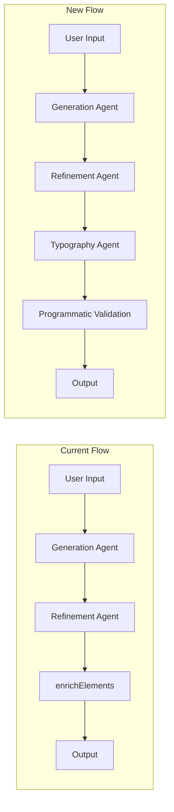

# Visual Notes Typography and Styling Improvements

## Problem Summary

The current Visual Notes output has several visual quality issues:

- Text is never centered within shapes (hardcoded `textAlign: 'left'`)
- All text uses hand-drawn font (hardcoded `fontFamily: 'virgil'`)
- Text often overflows or is too small for containers
- No validation that text fits within shapes

## Architecture Overview




## Implementation Plan

### 1. Update Element Schema for Typography

Modify `ELEMENT_SCHEMA` in [`server/src/routes/visualize.ts`](server/src/routes/visualize.ts) to include typography options:

```javascript
// Add to text element schema:
"fontFamily": "normal" | "virgil" | "code",  // NEW
"textAlign": "left" | "center" | "right",     // NEW
```


### 2. Enhance System Prompt with Typography Rules

Update `getSystemPrompt()` with explicit typography guidelines:

- **Font Selection Rules:**
- `normal` - For titles, headers, main concept labels, formal content
- `virgil` - For annotations, handwritten-style notes, informal additions
- `code` - For technical terms, code snippets, variable names, formulas
- **Text Alignment Rules:**
- `center` - For text inside shapes (labels within rectangles, ellipses, diamonds)
- `left` - For standalone annotations, lists, multi-line descriptions
- **Text Sizing Rules:**
- Explicit formula: `shape_width >= text_length * fontSize * 0.6 + 40px padding`
- Minimum font sizes by context (titles: 20-24px, labels: 16-18px, annotations: 14-16px)

### 3. Add Typography Agent (3rd Agent)

Create a new `refineTypography()` function that runs after layout refinement:

```typescript
const TYPOGRAPHY_PROMPT = `You are a typography specialist. Review these diagram elements and fix:

1. TEXT CENTERING: For text inside shapes, set textAlign to "center"
2. FONT SELECTION:
    - Titles/headers: "normal" font  
    - Annotations/notes: "virgil" font
    - Code/technical: "code" font
3. SIZE VALIDATION: Ensure text fits in associated shapes
    - If text is too long, either increase shape width or reduce fontSize
4. VISUAL HIERARCHY: Larger fontSize for important concepts

Output the corrected JSON array. Only modify text-related properties.`
```

This agent specifically focuses on:

- Matching text elements to their containing shapes
- Selecting appropriate fonts based on content semantics
- Ensuring text fits within containers
- Applying consistent text alignment

### 4. Programmatic Validation Layer

Add `validateTypography()` function for deterministic fixes:

```typescript
function validateTypography(elements: unknown[]): unknown[] {
  // 1. Find text-shape pairs (text inside or near shapes)
  // 2. For text inside shapes: force textAlign: "center"
  // 3. Estimate text width and validate against shape width
  // 4. Adjust fontSize if text overflows
  // 5. Apply default fontFamily if not set
}
```

Key validations:

- Text bounding box calculation based on `text.length * fontSize * 0.6`
- Automatic centering for text overlapping with shapes
- Font size reduction if text exceeds container width
- Minimum padding enforcement (20px on each side)

### 5. Update enrichElements()

Modify to respect AI-provided typography instead of overriding:

```typescript
// Current (problematic):
fontFamily: 'virgil',
textAlign: 'left',

// New (preserve AI choices with fallbacks):
fontFamily: element.fontFamily || 'normal',
textAlign: element.textAlign || 'center',
```


## Files to Modify

| File | Changes ||------|---------|| [`server/src/routes/visualize.ts`](server/src/routes/visualize.ts) | Schema updates, prompt enhancements, typography agent, validation layer |

## Expected Improvements

1. **Centered text** in shapes for better visual balance
2. **Appropriate fonts** - clean fonts for headers, hand-drawn for informal notes